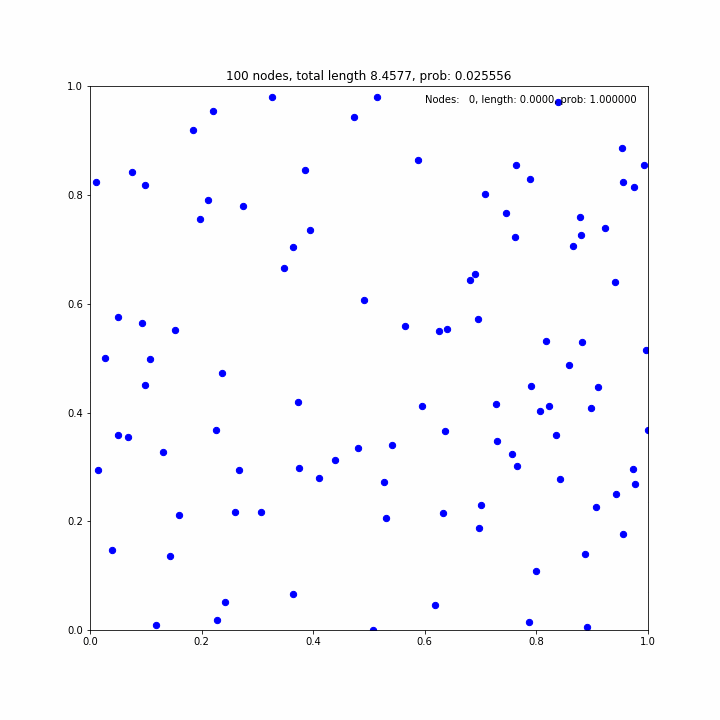

> Note: I am currently not able to actively maintain this repository. Please also checkout more recent implementations, e.g. https://github.com/ai4co/rl4co and https://github.com/cpwan/RLOR.

# Attention, Learn to Solve Routing Problems!

Attention based model for learning to solve the Travelling Salesman Problem (TSP) and the Vehicle Routing Problem (VRP), Orienteering Problem (OP) and (Stochastic) Prize Collecting TSP (PCTSP). Training with REINFORCE with greedy rollout baseline.



## Paper
For more details, please see our paper [Attention, Learn to Solve Routing Problems!](https://openreview.net/forum?id=ByxBFsRqYm) which has been accepted at [ICLR 2019](https://iclr.cc/Conferences/2019). If this code is useful for your work, please cite our paper:

```
@inproceedings{
    kool2018attention,
    title={Attention, Learn to Solve Routing Problems!},
    author={Wouter Kool and Herke van Hoof and Max Welling},
    booktitle={International Conference on Learning Representations},
    year={2019},
    url={https://openreview.net/forum?id=ByxBFsRqYm},
}
``` 

## Dependencies

* Python>=3.8
* NumPy
* SciPy
* [PyTorch](http://pytorch.org/)>=1.7
* tqdm
* [tensorboard_logger](https://github.com/TeamHG-Memex/tensorboard_logger)
* Matplotlib (optional, only for plotting)

## Quick start

For training TSP instances with 20 nodes and using rollout as REINFORCE baseline:
```bash
python run.py --graph_size 20 --baseline rollout --run_name 'tsp20_rollout'
```

## Usage

### Generating data

Training data is generated on the fly. To generate validation and test data (same as used in the paper) for all problems:
```bash
python generate_data.py --problem all --name validation --seed 4321
python generate_data.py --problem all --name test --seed 1234
python generate_data.py --problem tsp --name test --seed 1234
```

### Training

For training TSP instances with 20 nodes and using rollout as REINFORCE baseline and using the generated validation set:
```bash
python run.py --graph_size 20 --baseline rollout --run_name 'tsp20_rollout' --val_dataset data/tsp/tsp20_validation_seed4321.pkl
python run.py --graph_size 4 --baseline rollout --run_name 'acharpi' --val_dataset data/tsp/tsp4_tsp_seed1234.pkl --epoch_size 100 --batch_size 100 --val_size 100
python run.py --graph_size 11 --baseline rollout --problem tsp --run_name 'trp10_rollout' --val_dataset data/trp/train_S10_R1.pkl --epoch_size 19 --n_epochs 100 --batch_size 19 --val_size 19
python run.py --graph_size 21 --problem tsp --run_name trp_all --val_dataset data/trp/trp_all_S20.pkl --epoch_size 128000 --multiplier 100
```

#### Multiple GPUs
By default, training will happen *on all available GPUs*. To disable CUDA at all, add the flag `--no_cuda`. 
Set the environment variable `CUDA_VISIBLE_DEVICES` to only use specific GPUs:
```bash
CUDA_VISIBLE_DEVICES=2,3 python run.py 
```
Note that using multiple GPUs has limited efficiency for small problem sizes (up to 50 nodes).

#### Warm start
You can initialize a run using a pretrained model by using the `--load_path` option:
```bash
python run.py --graph_size 100 --load_path pretrained/tsp_100/epoch-99.pt
```

The `--load_path` option can also be used to load an earlier run, in which case also the optimizer state will be loaded:
```bash
python run.py --graph_size 20 --load_path 'outputs/tsp_20/tsp20_rollout_{datetime}/epoch-0.pt'
```

The `--resume` option can be used instead of the `--load_path` option, which will try to resume the run, e.g. load additionally the baseline state, set the current epoch/step counter and set the random number generator state.

### Evaluation
To evaluate a model, you can add the `--eval-only` flag to `run.py`, or use `eval.py`, which will additionally measure timing and save the results:
```bash
python eval.py data/tsp/tsp20_test_seed1234.pkl --model pretrained/tsp_20 --decode_strategy greedy
python eval.py data/tsp/tsp5_teste01_seed1234.pkl --model pretrained/tsp_20 --decode_strategy **greedy**
python eval.py data/trp/S10_R1.pkl --model outputs/tsp_10/trp1 --decode_strategy greedy
python eval.py data/trp/S10_R1.pkl --model outputs/tsp_11/trp02 --decode_strategy greedy
python eval.py data/trp/S10_R1.pkl --model pretrained/tsp_20 --decode_strategy greedy

```

If the epoch is not specified, by default the last one in the folder will be used.

#### Sampling
To report the best of 1280 sampled solutions, use
```bash
python eval.py data/tsp/tsp20_test_seed1234.pkl --model pretrained/tsp_20 --decode_strategy sample --width 1280 --eval_batch_size 1
```
Beam Search (not in the paper) is also recently added and can be used using `--decode_strategy bs --width {beam_size}`.

#### To run baselines
Baselines for different problems are within the corresponding folders and can be ran (on multiple datasets at once) as follows
```bash
python -m problems.tsp.tsp_baseline farthest_insertion data/tsp/tsp20_test_seed1234.pkl data/tsp/tsp50_test_seed1234.pkl data/tsp/tsp100_test_seed1234.pkl
```
To run baselines, you need to install [Compass](https://github.com/bcamath-ds/compass) by running the `install_compass.sh` script from within the `problems/op` directory and [Concorde](http://www.math.uwaterloo.ca/tsp/concorde.html) using the `install_concorde.sh` script from within `problems/tsp`. [LKH3](http://akira.ruc.dk/~keld/research/LKH-3/) should be automatically downloaded and installed when required. To use [Gurobi](http://www.gurobi.com), obtain a ([free academic](http://www.gurobi.com/registration/academic-license-reg)) license and follow the [installation instructions](https://www.gurobi.com/documentation/8.1/quickstart_windows/installing_the_anaconda_py.html).

### Other options and help
```bash
python run.py -h
python eval.py -h
```

### Example CVRP solution
See `plot_vrp.ipynb` for an example of loading a pretrained model and plotting the result for Capacitated VRP with 100 nodes.


## Acknowledgements
Thanks to [pemami4911/neural-combinatorial-rl-pytorch](https://github.com/pemami4911/neural-combinatorial-rl-pytorch) for getting me started with the code for the Pointer Network.

This repository includes adaptions of the following repositories as baselines:
* https://github.com/MichelDeudon/encode-attend-navigate
* https://github.com/mc-ride/orienteering
* https://github.com/jordanamecler/PCTSP
* https://github.com/rafael2reis/salesman
